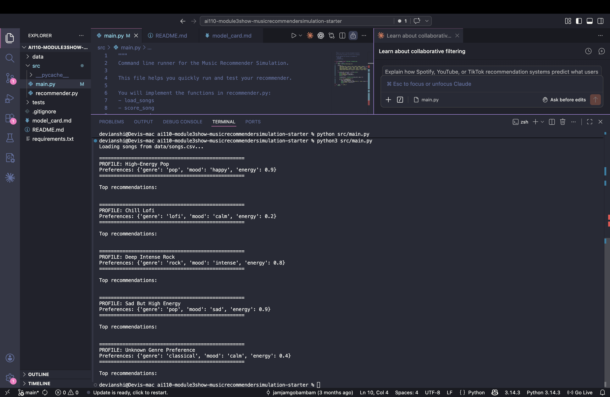
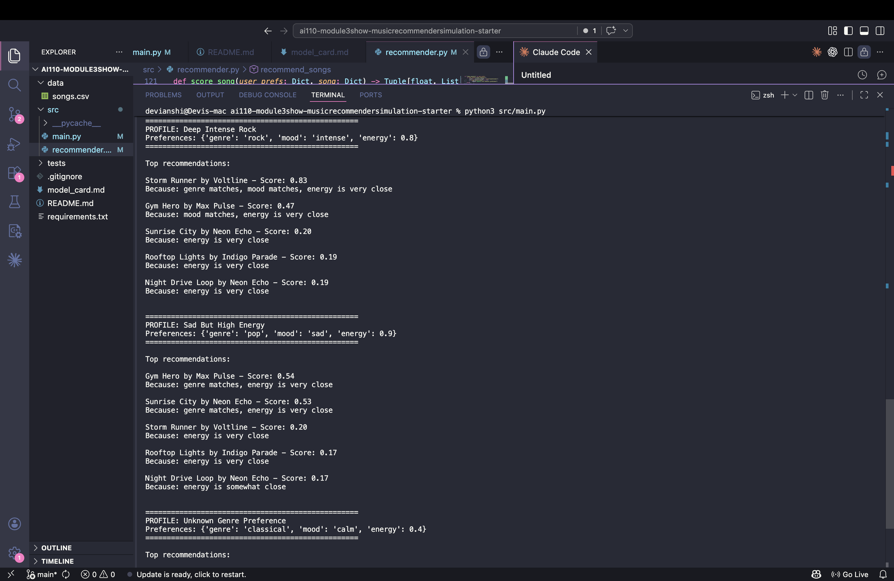
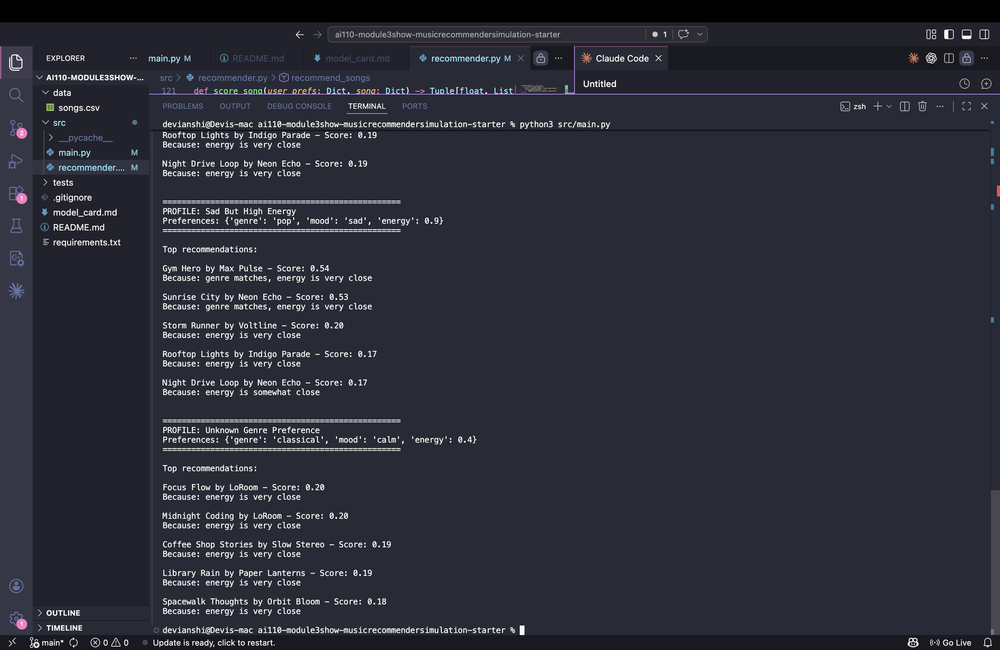
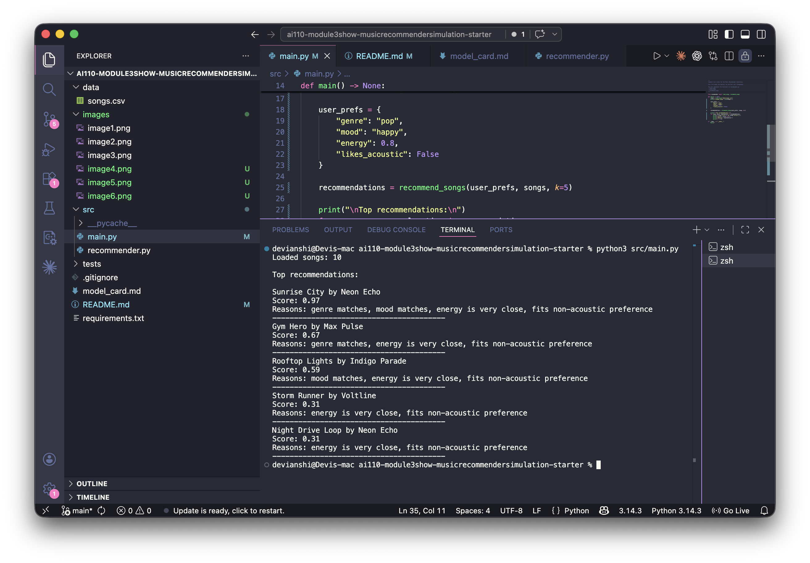
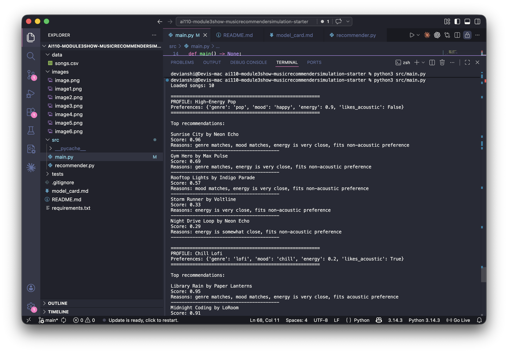
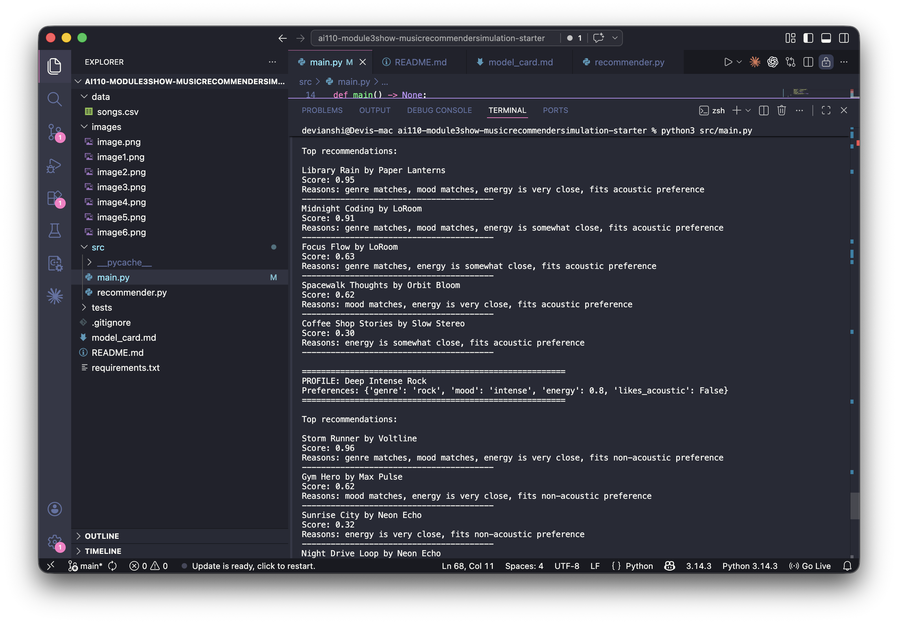
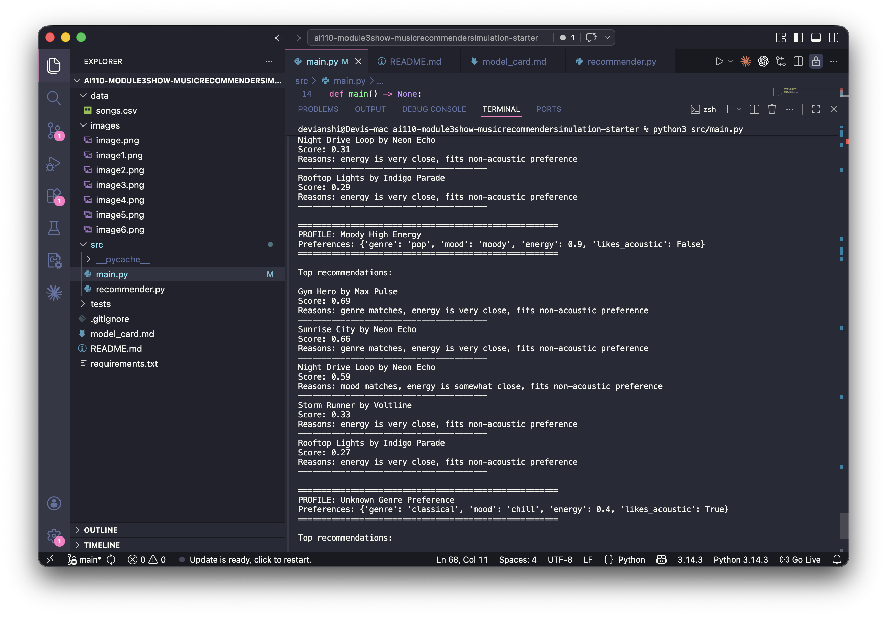
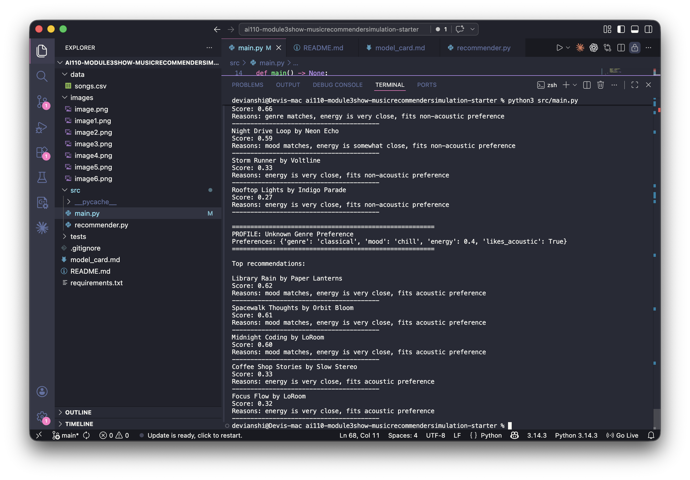

# 🎵 Music Recommender Simulation

## Project Summary

This project simulates a content-based music recommender system. The goal is to understand how recommendation systems turn user preferences into predictions by comparing song features such as genre, mood, and energy.

The system assigns each song a weighted score, ranks all songs, and returns the top recommendations. This project helped me understand how simple algorithms can still create meaningful and personalized suggestions.


---

## How The System Works
This recommender uses a content-based approach. It compares each song directly with a user’s preferences.

### Song Features
Each song includes:
- genre  
- mood  
- energy  
- tempo_bpm  
- valence  
- danceability  
- acousticness  

### User Profile
Each user profile includes:
- preferred genre  
- preferred mood  
- target energy level  
- acoustic preference


## Scoring Logic

Each song is scored based on how well it matches the user:

- Genre match → high points  
- Mood match → high points  
- Energy → partial points based on closeness  
- Acoustic preference → small bonus  

After scoring:
- Songs are sorted from highest to lowest  
- Top 5 songs are returned

---

## Getting Started

### Setup

1. Create a virtual environment (optional but recommended):

   ```bash
   python -m venv .venv
   source .venv/bin/activate      # Mac or Linux
   .venv\Scripts\activate         # Windows

2. Install dependencies

```bash
pip install -r requirements.txt
```

3. Run the app:

```bash
python -m src.main
```

### Running Tests

Run the starter tests with:

```bash
pytest
```

You can add more tests in `tests/test_recommender.py`.

---

## Experiments You Tried

I tested the recommender using multiple user profiles:

High-Energy Pop
Chill Lofi
Deep Intense Rock
Moody High Energy
Unknown Genre Preference
Observations
High-Energy Pop → returned energetic pop songs
Chill Lofi → returned calm, low-energy songs
Deep Intense Rock → returned intense rock songs
Edge Cases
Moody High Energy → energy dominated over mood
Unknown Genre → system relied mostly on energy
Experiment

I modified the scoring logic (e.g., increasing energy weight or removing mood).

Result:

Recommendations changed significantly
The system is sensitive to feature weights
Over-weighting one feature reduces balance

## Screenshots










---

## Limitations and Risks

Small dataset (~10 songs)
Limited features (no lyrics, popularity, or user history)
Can repeat similar songs across profiles
Struggles with conflicting preferences
Can create “filter bubbles”


---

## Reflection

This project helped me understand how recommendation systems turn user preferences into predictions using structured data and simple scoring rules.

I learned that even basic algorithms can feel realistic, but they are highly sensitive to the features and weights used. Small changes in scoring logic can completely change recommendations.

Using AI tools helped me generate ideas and debug code faster, but I had to verify the logic to make sure it matched my intended design.

What surprised me most is how simple systems can still produce convincing recommendations. If I extended this project, I would explore using more data and combining content-based filtering with collaborative filtering.


---

## 7. `model_card_template.md`

Combines reflection and model card framing from the Module 3 guidance. :contentReference[oaicite:2]{index=2}  

```markdown
# 🎧 Model Card - Music Recommender Simulation

## 1. Model Name

Give your recommender a name, for example:

> VibeFinder 1.0

---

## 2. Intended Use

- What is this system trying to do
- Who is it for

Example:

> This model suggests 3 to 5 songs from a small catalog based on a user's preferred genre, mood, and energy level. It is for classroom exploration only, not for real users.

---

## 3. How It Works (Short Explanation)

Describe your scoring logic in plain language.

- What features of each song does it consider
- What information about the user does it use
- How does it turn those into a number

Try to avoid code in this section, treat it like an explanation to a non programmer.

---

## 4. Data

Describe your dataset.

- How many songs are in `data/songs.csv`
- Did you add or remove any songs
- What kinds of genres or moods are represented
- Whose taste does this data mostly reflect

---

## 5. Strengths

Where does your recommender work well

You can think about:
- Situations where the top results "felt right"
- Particular user profiles it served well
- Simplicity or transparency benefits

---

## 6. Limitations and Bias

Where does your recommender struggle

Some prompts:
- Does it ignore some genres or moods
- Does it treat all users as if they have the same taste shape
- Is it biased toward high energy or one genre by default
- How could this be unfair if used in a real product

---

## 7. Evaluation

How did you check your system

Examples:
- You tried multiple user profiles and wrote down whether the results matched your expectations
- You compared your simulation to what a real app like Spotify or YouTube tends to recommend
- You wrote tests for your scoring logic

You do not need a numeric metric, but if you used one, explain what it measures.

---

## 8. Future Work

If you had more time, how would you improve this recommender

Examples:

- Add support for multiple users and "group vibe" recommendations
- Balance diversity of songs instead of always picking the closest match
- Use more features, like tempo ranges or lyric themes

---

## 9. Personal Reflection

This project helped me understand how recommendation systems turn user preferences into predictions using structured data. I learned how features like genre, mood, and energy are compared with song attributes to generate a score, which is then used to rank songs.

While testing different profiles, I noticed that the system often relied heavily on energy and genre, especially when preferences were conflicting or missing. This showed me how even simple recommender systems can develop bias or become repetitive.

Overall, building this system helped me realize that platforms like Spotify and TikTok are not random. Their recommendations are based on patterns, weights, and data limitations, and they can strongly influence what users discover.